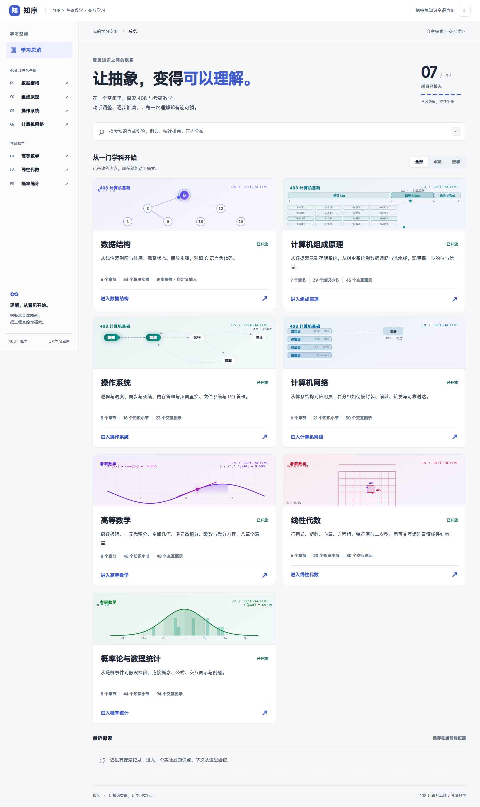
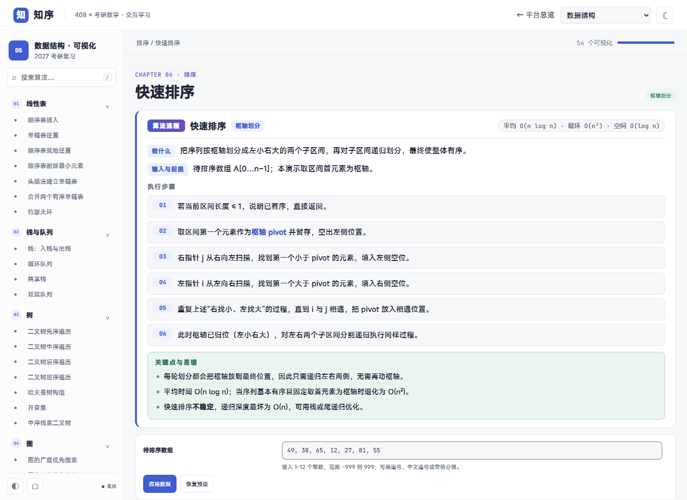

# 知序 · 408 与考研数学交互学习平台

一个**纯静态、可离线**的交互学习平台：把 408 四科与考研数学的抽象知识拆成可播放、可拖动、可验证的图形与动画。构建产物即完整站点，无需账号、数据库与后端服务即可学习；「知识掌握度」为可选后端能力，未部署时前端自动静默降级。

**在线体验：** <https://recaord.top/math-modeling/>

**代码仓库：** [GitHub](https://github.com/fzf050630/zhixu-learning-platform) · [Gitee](https://gitee.com/fu-zhifeng0630/zhixu-learning-platform)

**本轮新增功能**（平衡树删除可视化、首次访问说明、访问安全加固、只读数据观察台、SQLite→MySQL 镜像）见 [2026 年 9 月功能与设计说明](docs/FEATURES-2026-09.md)。





## 特性

- **七科全覆盖**：数据结构、计算机组成原理、操作系统、计算机网络、高等数学、线性代数、概率论与数理统计。
- **240 个学习入口**：54 个数据结构算法实验 + 186 个知识小节，支持全站搜索与深浅主题。
- **324 个交互可视化**：每一步都能动手调整参数、逐步播放、观察状态变化。
- **平衡树的增删全流程**：红黑树、B 树、B+ 树与 AVL 树都支持插入与删除，可自定义「插入序列 + 删除序列」；红黑树按 CLRS 演示双黑修复的四种情形（空孩子显式画成黑色 NIL），B 树与 B+ 树演示借位、合并与降高，B+ 树同步维护分隔键与叶链。
- **138 处算法说明**：出现算法的小节配有统一「算法流程」板块（做什么 / 输入与前提 / 执行步骤 / 关键点与易错 / 复杂度），数据结构 54 个实验各自附带同款说明面板。
- **零依赖运行**：无框架、无 CDN、无网络请求；KaTeX 与字体全部本地化，`file://` 直接打开也能使用。

| 科目 | 章节 | 小节/实验 | 交互可视化 | 算法流程板块 |
| --- | --- | --- | --- | --- |
| 数据结构 | 6 | 54 个实验 | 54 | 54 份实验说明 |
| 计算机组成原理 | 7 | 39 | 45 | 24 |
| 操作系统 | 5 | 16 | 23 | 31 |
| 计算机网络 | 6 | 21 | 30 | 29 |
| 高等数学 | 8 | 46 | 48 | — |
| 线性代数 | 6 | 20 | 30 | — |
| 概率论与数理统计 | 8 | 44 | 94 | — |

## 快速开始

需要 Node.js 20 或更新版本（仅用于构建与本地预览，运行站点不需要 Node）：

```bash
npm run dev          # 构建 dist 并启动带掌握度后端的开发服务器
npm run dev:static   # 仅静态站点（无后端）
```

浏览器访问 <http://127.0.0.1:8787/>（`dev:static` 为 <http://127.0.0.1:8766/>）。修改源码后重新运行 `npm run build` 并刷新即可；也可以直接双击根目录 `index.html`，完整目录在一起时支持离线使用。

**Windows 一键启动**：双击根目录的 `启动知序.cmd`，会自动构建（首次）、启动后端并打开浏览器。

## 构建与部署

```bash
npm run build     # 生成 dist/（白名单发布，排除教材 PDF、源码备份与测试产物）
npm run preview   # 本地 HTTP 预览 dist/
```

`dist/` 是完整网站，只需部署这一目录：

1. **静态托管 / Nginx / 宝塔**：把 `dist/` 里的内容上传到站点目录，确保根目录直接包含 `index.html`、`platform/`、`subjects/`。项目使用 hash 路由，无需额外重写规则；部署到子目录（如 `/math-modeling/`）同样可用。
2. **Docker Compose**：

   ```bash
   docker compose up -d --build
   ```

   默认监听 `127.0.0.1:8080`，见 [部署说明](docs/DEPLOYMENT.md)。

## 工程结构

```text
index.html                        统一门户（七科入口、搜索、最近访问）
mastery.html                      掌握度热力图页面（逐小节掌握度）
启动知序.cmd                       Windows 一键启动（构建 + 后端 + 打开浏览器）
platform/                         共享层：主题、导航、门户脚本与样式
  mastery.js                      学习行为采集（掌握度前端）
  mastery-ui.js / .css            掌握度徽标、状态卡片与目录标注
  quiz.js / .css                  自测答题运行时
  questions/<subject>.js          分科目自测题库（原创“真题风格”题）
  questions/<subject>.q5.js       题库补足文件（每节 5 题）
  heatmap.js / .css               门户知识热力图
  mastery-page.js / .css          掌握度热力图页面脚本与样式
scripts/                          catalog / build / audit / serve / 校验脚本
server/                           掌握度后端（node:http + node:sqlite）
  services/                       指标、规则掌握度、Jev、评估、复习调度
  repositories/                   LearningEvent / 知识状态 / 评估 / 复习计划
  db/schema.sql                   SQLite 表结构
subjects 目录（七个）              各科内容与可视化组件源码
  content/ch*.js                  章节内容（含算法板块与例题）
  assets/js/widgets/*.js          Canvas 交互组件
  assets/js/lib/draw.js           轻量绘图引擎（HiDPI / 主题联动 / 自适应）
  assets/css/main.css             科目样式
tests/                            平台单元测试、后端测试与浏览器测试
docs/                             部署、扩展、验收与功能设计文档
```

数据驱动的渲染方式：内容以 JS 数据块（`h3`、`p`、`table`、`fml`、`viz`、`algo` 等）声明，`app.js` 负责渲染；新增可视化只需实现一个 `window.WIDGETS.<name>` 组件并注册 `{ t: 'viz', build: '<name>' }` 内容块，详见 [扩展说明](docs/EXTENDING.md)。

## 测试

```bash
npm test                      # 平台结构与发布白名单测试
npm run test:server           # 掌握度后端单元与接口测试
npm run audit                 # 七科内容结构审查（锚点、例题、易错点、组件引用）
npm run test:browser          # 门户与子路径浏览器测试（Playwright + 本机 Chrome）
npm --prefix 数据结构可视化 test           # 数据结构算法单元测试
npm --prefix 数据结构可视化 run test:browser  # 含全部 54 个实验自动播放
```

另有源码直检与发布产物全量检查脚本：`node scripts/check-source.cjs <科目目录>`、`node scripts/verify-all.cjs`（240 个入口逐一检查脚本错误、组件失败、KaTeX 错误与文本越界）。

## 设计与技术要点

- **零框架 Canvas 引擎**：`draw.js` 提供场景/坐标系、渐变图元、主题色读取与尺寸自适应，约 200 个可视化组件共用；标签在窄屏下自动收缩、画布可横向滚动，避免文字裁切。
- **内容与渲染分离**：算法步骤、伪代码、例题、易错点均为结构化数据，便于审查与生成目录。
- **可访问性与细节**：统一的键盘操作（`/` 搜索、`Esc` 关闭、方向键播放）、深浅主题持久化、打印样式、`prefers-reduced-motion` 降级。
- **字体**：正文首选 MiSans（回退思源黑体 / 苹方 / 微软雅黑），代码与数字使用 JetBrains Mono；全部随站点本地加载。
- **构建白名单**：发布脚本只复制运行所需文件，教材 PDF、备份、测试与开发文档不会进入 `dist/`。

## 知识掌握度（可选后端）

`server/` 提供一套零第三方依赖的掌握度后端（Node 22 内置 `http` + `node:sqlite`）：

- **数据层**：学习行为记录为 `LearningEvent`，逐用户逐知识节点维护 `UserKnowledgeState`，并保留每次评估历史与复习计划。
- **确定性计算**：正确率、近期正确率、连续正确、提示率、学习/复习次数、距上次学习时间等指标由后端程序计算。
- **规则掌握度**：`RuleScore` 按正确率 / 近期表现 / 独立性 / 稳定性 / 完成度 / 效率加权；时间衰减与复习紧迫度据此推导。
- **Jev（TypeSafe）**：可选接入，API Key 只存在服务器端；未配置或调用失败时自动回退规则引擎，不影响学习流程。
- **身份与防护**：用户数据接口的身份由服务端签发的**匿名设备令牌**（HMAC 签名）决定，客户端无法冒充别人的 `userId`；写接口按 IP 限流（默认 60 次/分、2000 次/天），并有 **Jev 每日成本保险丝**（全局 300 次 + 单 IP 30 次），超限自动回退规则引擎。详见 [部署说明](docs/DEPLOYMENT.md)。

```bash
npm run server      # 启动后端（默认 127.0.0.1:8787，同时提供 dist 静态站点与 /api）
npm run dev         # 构建 dist 后启动后端
```

前端 `platform/mastery.js` 采集 `NODE_OPEN`、`CONTENT_READ`、`VISUALIZATION_OPEN`、`EXPERIMENT_START/COMPLETE`、`HINT_OPEN`、`ANSWER_VIEW` 等事件并批量上报；页面为 `file://` 或后端不可用时自动停用上报。接口与配置见 [部署说明](docs/DEPLOYMENT.md)。

`platform/mastery-ui.js` 在平台头部显示当前节点的掌握度徽标（如「掌握度 76% · 熟练掌握」），点开为状态卡片：掌握度进度条、稳定度、复习紧迫度、当前薄弱点、下一步建议与复习时间；知识目录中的节点会标注掌握百分比。后端不可用时整体隐藏，不打扰学习。

`platform/questions/` + `quiz.js` 提供节点自测：有题目的节点在状态卡片里出现「开始自测」，答题过程产生 `QUESTION_START / HINT_OPEN / ANSWER_VIEW / QUESTION_SUBMIT / QUIZ_COMPLETE` 事件，直接驱动掌握度。题库按科目分文件（`platform/questions/<subject>.js` 为基础题、`<subject>.q5.js` 为补足题），**覆盖全部 46 章、240 个知识小节，每节 5 题，共 1200 道原创「真题风格」题**；新增题目只需往对应文件追加，`npm test` 会校验节点 ID、答案合法性、题干长度，以及「每节恰好 5 题」。

门户首页新增「学习状态」热力图：按学科与章节展示加权掌握度（父节点按节点权重加权，而非简单平均），无数据时自动隐藏。

独立页面 `mastery.html`（掌握度热力图）汇总全部内容：综合掌握度、学科/章节加权热力、待复习计划，以及**全部 240 个小节的逐节掌握度**（未评估显示「未评估」）。平台头部各页均可进入。科目页面左下角的状态会显示「在线 / 离线」，反映后端是否连接。

## 数据与隐私

未部署后端时，站点没有账号、数据库、埋点或网络请求，主题、最近访问与掌握标记保存在浏览器 `localStorage` 中。启用掌握度后端后，只上报匿名设备标识（`localStorage` 生成的随机 ID）与学习行为，不采集真实姓名、邮箱、手机号等身份信息。用户数据接口需要服务端签发的**匿名设备令牌**（令牌里只有一个随机标识与有效期，不含任何身份信息），该令牌无法被伪造，因此别人不能冒充你的标识写入或读取数据。

门户首次访问会显示一次平台说明（架构、Jev 决策层、与主站的关系、免责声明与数据说明），**读完全文后才能确认**；确认状态记在浏览器，页脚「关于本站」可随时重新阅读。同时后端会记录一条**匿名访问记录**（`zx_site_visit` 表：IP、User-Agent、来源页、语言、屏幕尺寸、时区与时间），仅用于了解访问情况与排查问题，不做广告追踪、不与第三方共享，也不做第三方 IP 归属地查询；可用 `node scripts/visits-report.cjs` 在服务器本机查看汇总（默认把 IP 末段打码）。

## 开源协议

本项目以 [MIT License](LICENSE) 开源，可自由使用、修改与分发（保留版权声明）。

- 知识点整理自公开考试大纲与教材主线，页面中的讲解、步骤说明、图示与预设案例均为**独立编写**；仓库不含任何教材或大纲 PDF（已在 `.gitignore` 中排除）。
- 第三方资源：数学公式渲染 [KaTeX](https://katex.org/)（MIT）、代码字体 [JetBrains Mono](https://www.jetbrains.com/lp/mono/)（SIL OFL 1.1），均以本地文件形式随站点分发，版权归原作者所有。

## 贡献

欢迎提交 Issue 与 Pull Request：修正知识点、补充可视化、改进样式与可访问性均可。提交前请运行 `npm test`、`npm run audit` 与 `node scripts/check-source.cjs <对应科目>` 保证内容结构完整。
